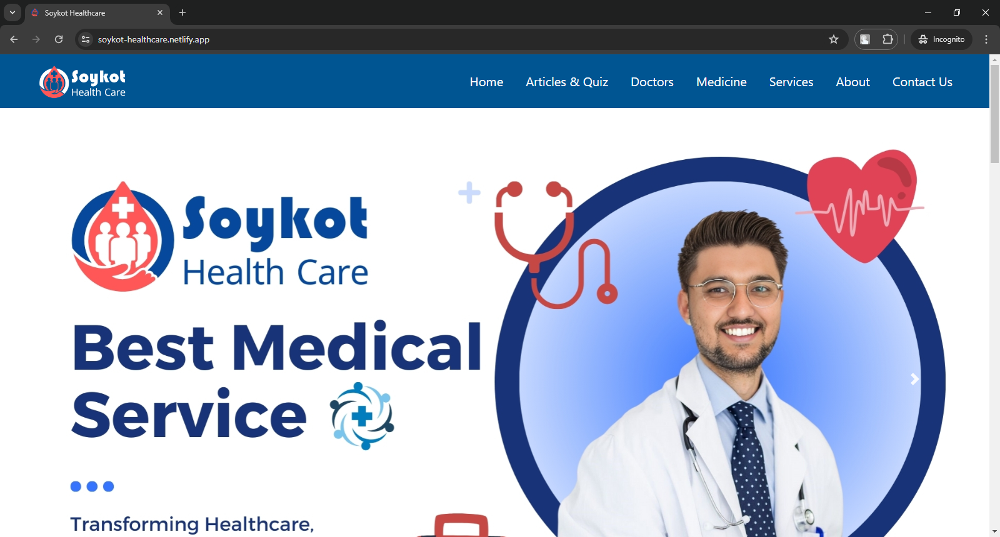
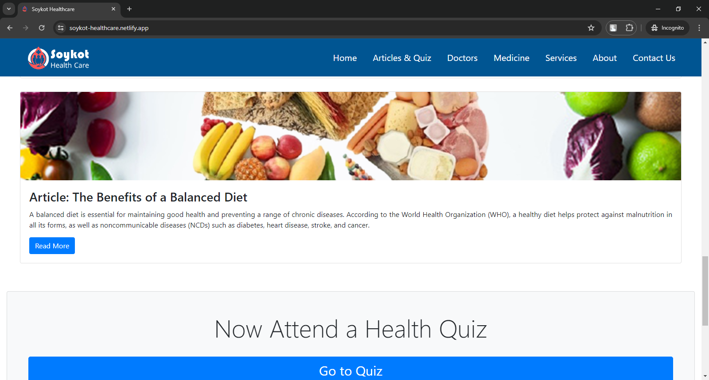
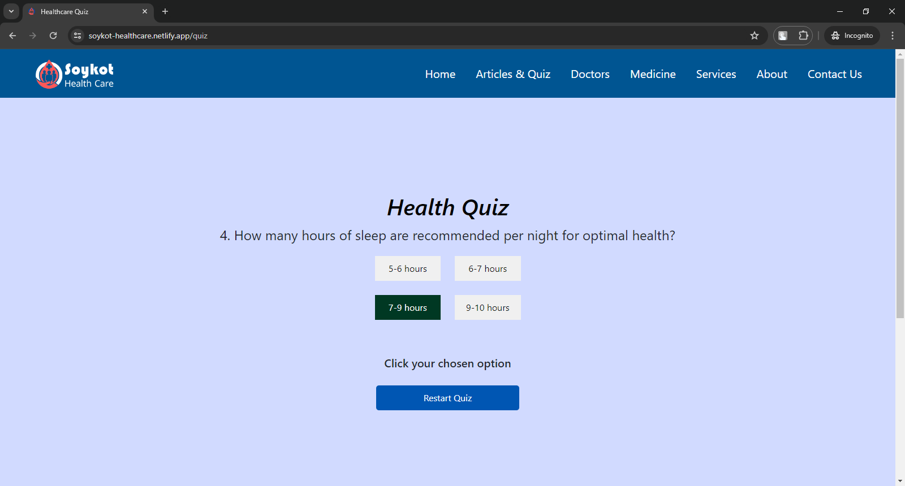
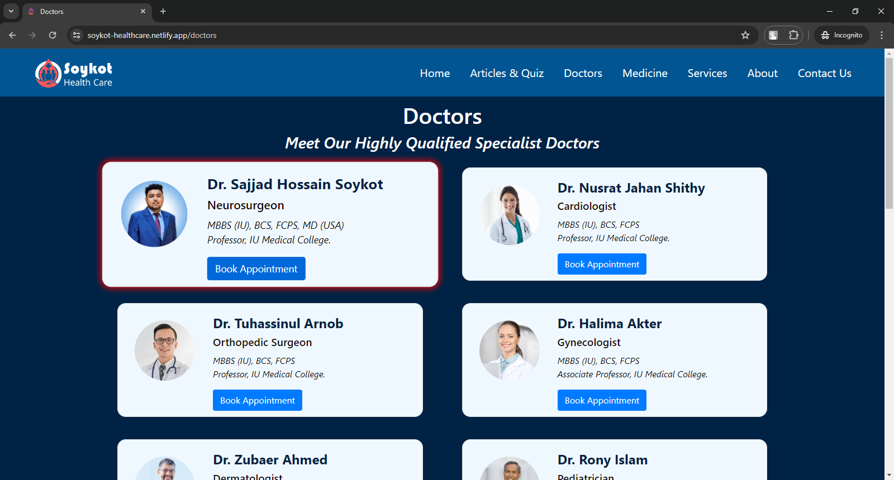
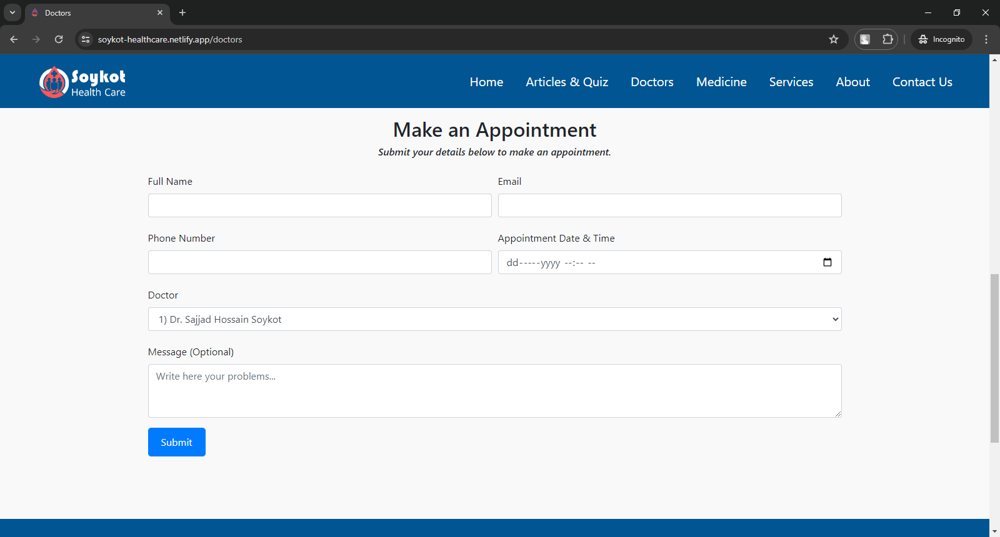
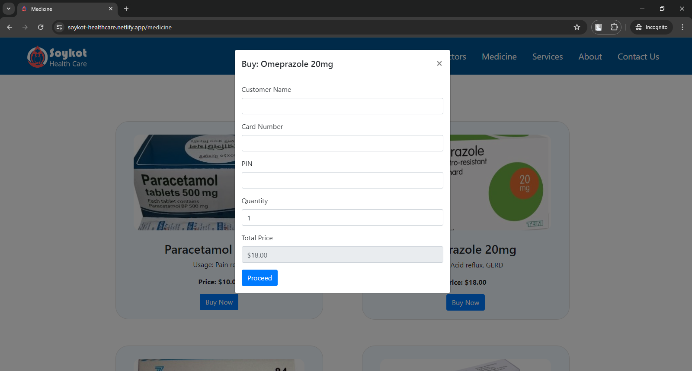

# Soykot Health Care

Welcome to the Soykot Health Care project, developed as the final project for the EDGE-IUICT Front End Development Course. This project is a comprehensive healthcare platform designed to enhance accessibility and provide a range of services to users.

## 🌟 Introduction

Soykot Health Care is a responsive and user-friendly website that offers a variety of healthcare-related features. Inspired by my personal experiences with healthcare services, this project aims to empower individuals by providing easy access to medical information, appointments, and more.

## 🚀 Features

- **Responsive Design**: Accessible across various devices ensuring a seamless user experience.
- **Bootstrap Integration**: Utilizes Bootstrap for robust and stylish layout components.
- **Dynamic Content**: JavaScript is used to generate dynamic content elements.
- **Rich Typography**: Google Fonts enhance readability and aesthetics.
- **Iconography**: Fontawesome icons add visual appeal and functionality.

## 💻 Technology Used

<p align="center">
    
</p>

## 🎥 Demo

Check out the live demo of the project [soykot-healthcare.netlify.app](soykot-healthcare.netlify.app).

Watch a short demo video to see the project in action: [Soykot Health Care Demo Video](https://youtu.be/713qPXvmqTE?si=6PcWkX4Ith4-GVlQ)

## 📸 Screenshots
*Homepage*


*Articles Section*


*Attending Quiz*


*Doctors Section*


*Appointment Booking*


*Buy Medicine*



## 🛠️ How to Run the Project

1. **Clone the repository**:
    ```bash
    git clone https://github.com/SajjadHossainSoykot/EDGEIUICT-201-Final-Project-Healthcare.git
    ```

2. **Navigate to the project directory**:
    ```bash
    cd EDGEIUICT-201-Final-Project-Healthcare
    ```

3. **Open the `index.html` file in your preferred browser**:
    ```bash
    open index.html
    ```

## 🔖 Tags

`bootstrap`, `responsive`, `health care`, `web development`, `html`, `css`, `javascript`, `google fonts`, `fontawesome`

## 🤝 Contributions

Contributions are welcome! Please fork this repository and submit a pull request for any enhancements or bug fixes.

## 📧 Contact

If you have any questions or suggestions, feel free to reach out to me at soykot.ict@gmail.com

## 📝 License

This project is dedicated to the public domain under the CC0 1.0 Universal (CC0 1.0) Public Domain Dedication. See the [LICENSE](LICENSE) file for more details.